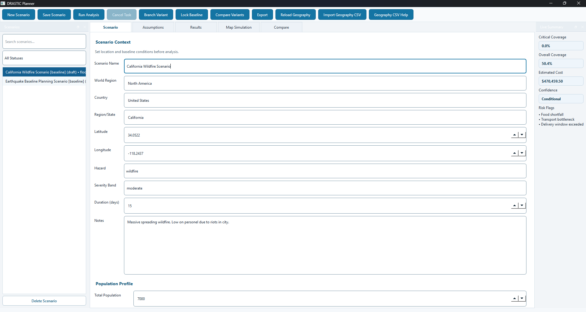
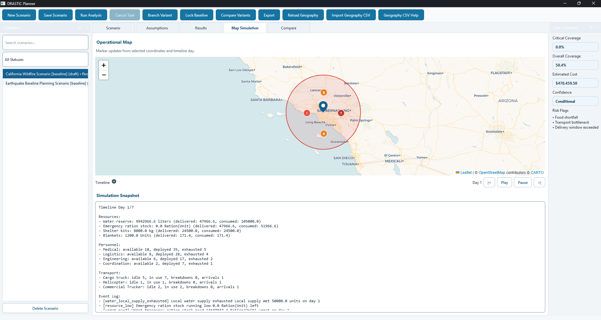
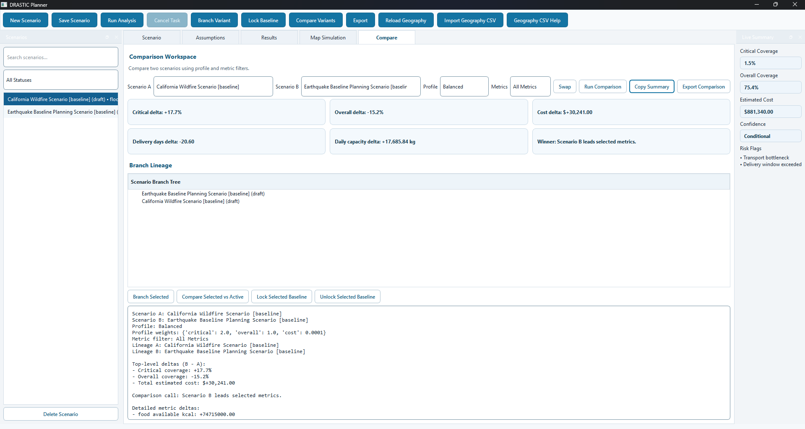

# DRASTIC Planner

## Description
A desktop decision-support tool for humanitarian scenario planning that turns uncertain crisis inputs into actionable coverage, staffing, transport, cost, and risk insights.

## Problem
Humanitarian planning often happens under time pressure, fragmented inputs, and shifting assumptions. Teams need to answer practical questions quickly:

- Are critical needs covered?
- Where are operational bottlenecks?
- What trade-offs exist between baseline and variant plans?
- How do assumptions affect confidence and risk?

Without a structured system, decisions are harder to audit, compare, and communicate.

## Solution
DRASTIC Planner provides an end-to-end desktop workflow for building crisis scenarios, running analytical projections, comparing variants, visualizing geospatial context, and exporting operational reports.

The system is engineered for practical use:

- Fast local execution
- Transparent assumptions and metrics
- Scenario versioning and lineage
- Accessible, keyboard-friendly UX

## Features
- Scenario modeling with structured domain objects for hazard, population, infrastructure, resources, personnel, and transport
- Modular planning engine pipeline:
  - Needs
  - Staffing
  - Transport
  - Cost
- Confidence scoring and risk flag generation for incomplete or constrained scenarios
- Scenario branching and lineage tracking for baseline vs variant planning
- Side-by-side scenario comparison with weighted profiles and metric filters
- Map simulation tab using Leaflet inside Qt WebEngine with location pins, overlays, and event markers
- Timeline projection snapshots for day-by-day operational context
- Async background workers for analysis, comparison, and report export to keep the UI responsive
- Accessibility improvements: keyboard shortcuts, accessible names, tab-order hardening, high-DPI support, WCAG contrast/focus updates
- Structured NDJSON performance telemetry
- SQLite persistence and audit events
- Scenario/comparison report export
- Windows packaging pipeline with PyInstaller + Inno Setup

## Tech Stack
- Python 3.12
- PySide6, PySide6-WebEngine
- SQLite
- Leaflet + CARTO raster tiles
- PyInstaller, Inno Setup
- unittest

## Screenshots & Features in Action

This is a fully functional desktop application for humanitarian scenario planning. Import your crisis parameters and get instant operational insights.

### Scenario Editor
Build structured crisis scenarios with hazard context, population data, infrastructure constraints, and operational resources.

**Features shown:**
- Structured scenario form with geolocation (latitude/longitude)
- Population profile breakdown (total, displaced, vulnerable groups)
- Infrastructure damage and facility operability metrics
- Resource inventory management (water, food, shelter, apparel)
- Personnel roster with roles (Medical, Logistics, Engineering, Coordination)
- Transportation assets (Cargo trucks, Helicopters, Commercial vehicles)
- Live summary metrics (coverage %, cost, confidence, risk flags)
- Sidebar scenario browser with search and delete

### Map Simulation
Visualize the crisis zone with real-time markers, coverage overlays, and day-by-day timeline progression.

**Features shown:**
- Interactive Leaflet map centered on crisis coordinates
- Coverage circle showing operational reach
- Event markers and location pins
- Timeline player with day-by-day state snapshots
- Simulation output including resource consumption and personnel status
- Event log for operational milestones

### Scenario Comparison
Side-by-side analysis comparing baseline and variant scenario outcomes to evaluate trade-offs.

**Features shown:**
- Metric delta comparison between scenarios
- Weighted profile analysis
- Coverage, cost, and risk metric filters
- Detailed operational impact assessment

## How It Works
1. Create or load a scenario from SQLite.
2. Configure hazard, population, infrastructure constraints, and operational assets.
3. Run analysis to compute needs, staffing, transport, cost, coverage, confidence, and risk flags.
4. Branch variants from baseline scenarios and compare outcomes.
5. Review timeline and map simulation outputs for operational planning context.
6. Export scenario or comparison reports for stakeholders.

## Challenges
- Keeping a rich desktop UI responsive while running non-trivial analysis and export workflows
- Integrating web map rendering in a native desktop shell with stable tile behavior
- Designing confidence and risk logic that remains interpretable for non-technical users
- Shipping a polished Windows installer without committing generated binaries
- Balancing accessibility, keyboard flow, and modern UX in a dense planning interface

## What I Learned
- Designing a modular analysis engine that remains extensible
- Building safe async worker patterns in Qt for long-running operations
- Structuring clear boundaries between UI, domain, services, and persistence
- Instrumenting performance telemetry for iterative engineering decisions
- Packaging Python desktop software for real end-user distribution

## Future Improvements
- Offline map tile caching for low-connectivity use cases
- Richer geospatial overlays and event visualization
- Additional export formats (CSV/PDF)
- Scenario import templates and guided validation
- Expanded automated tests around UI-worker boundaries and packaging smoke checks

## Installation
### Option A: End User (Recommended)
1. Download the latest installer executable.
2. Run the installer and follow the wizard.
3. Launch DRASTIC Planner from the Start Menu.

### Option B: Run from Source
1. Clone this repository.
2. Create and activate a virtual environment.
3. Install dependencies from `requirements.txt`.
4. Run `main.py`.

### Build Installer
1. Ensure Python and dependencies are installed.
2. Run `build.bat`.
3. Find installer output in `installer/Output`.

## Usage
1. Open the app and create/select a scenario.
2. Fill in assumptions and operational inputs.
3. Run analysis and review coverage/cost/risk outputs.
4. Create branch variants and compare trade-offs.
5. Export reports for planning communication.

## Author
Michael Donaldson  
